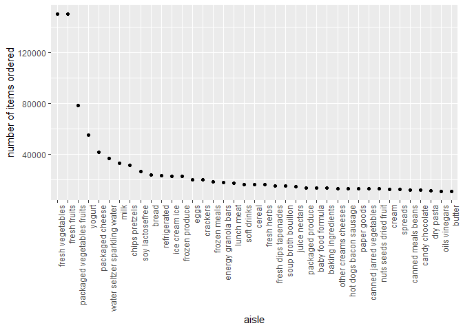
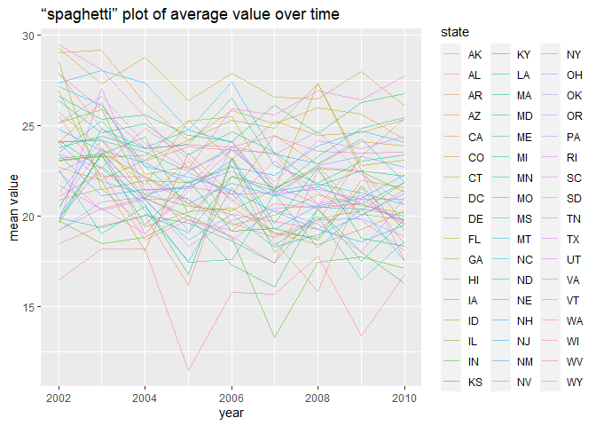
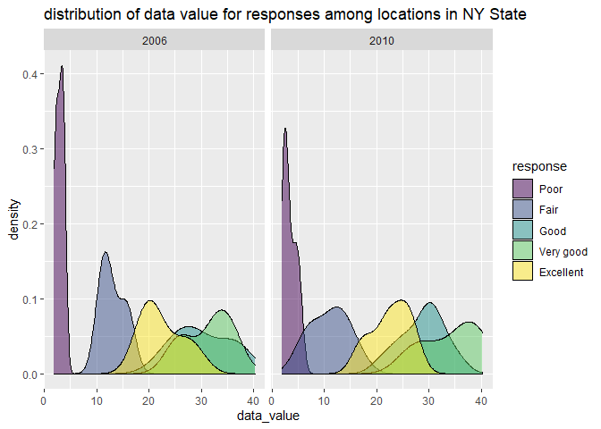
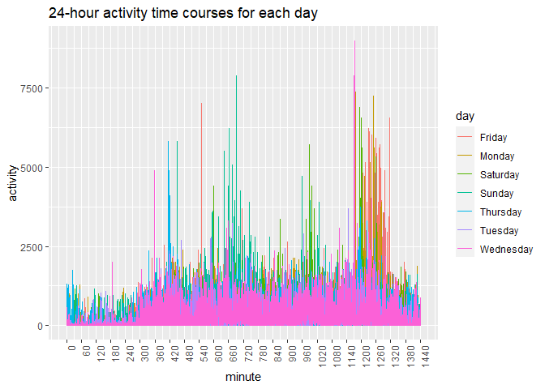

p8105\_hw3\_xz3078
================

## Problem 1

``` r
library(p8105.datasets)
data("instacart")
```

This dataset has 1384617 rows and 15 columns with variable names
order\_id, product\_id, add\_to\_cart\_order, reordered, user\_id,
eval\_set, order\_number, order\_dow, order\_hour\_of\_day,
days\_since\_prior\_order, product\_name, aisle\_id, department\_id,
aisle, department. Among these variables, “add\_to\_cart\_order” is
order in which each product was added to cart; “reordered” is a dummy
variable equals 1 if this prodcut has been ordered by this user in the
past, and 0 otherwise; “order\_number” is the order sequence number for
this user; “order\_dow” is the day of the week on which the order was
placed; “order\_hour\_of\_day” is the hour of the day on which the order
was placed; “days\_since\_prior\_order” is days since the last order,
capped at 30, NA if order\_number=1.

For example, the first row in “instacart” means the order id is 1; the
product id is 49302; it’s the first item added to the cart; it has been
ordered by this user before; the user id is 112108; this order belongs
in “train” evaluation set; the order sequence number for this user is 4;
the order is placed on Thursday 10am; 9 days since the last order; the
product is Bulgarian Yogurt; the aisle is yogurt with id 120; the
department is dairy eggs with id 16.

``` r
instacart %>%
  summarize(
    n_aisle = n_distinct(aisle))
```

    ## # A tibble: 1 x 1
    ##   n_aisle
    ##     <int>
    ## 1     134

``` r
instacart %>%
  group_by(aisle) %>%
  summarize(
    n_obs = n()) %>%
  arrange(desc(n_obs))
```

    ## # A tibble: 134 x 2
    ##    aisle                          n_obs
    ##    <chr>                          <int>
    ##  1 fresh vegetables              150609
    ##  2 fresh fruits                  150473
    ##  3 packaged vegetables fruits     78493
    ##  4 yogurt                         55240
    ##  5 packaged cheese                41699
    ##  6 water seltzer sparkling water  36617
    ##  7 milk                           32644
    ##  8 chips pretzels                 31269
    ##  9 soy lactosefree                26240
    ## 10 bread                          23635
    ## # ... with 124 more rows

There are 134 aisles, and fresh vegetables is the most items ordered
from.

``` r
instacart %>%
  group_by(aisle) %>%
  summarize(
    n_obs = n()) %>%
  filter(n_obs > 10000) %>%
  ggplot(aes(x = reorder(aisle, -n_obs), y= n_obs)) + 
    geom_point() +
  labs(y = "number of items ordered",
       x = "aisle") +
  theme(axis.text.x = element_text(angle=90, hjust=1))
```

<!-- -->

There are 39 aisles with more than 10000 items ordered. The aisles with
the most items ordered are fresh vegetables, fresh fruits, and packaged
vegetables fruits.

``` r
instacart %>%
  filter(aisle %in% c("baking ingredients", "dog food care", "packaged vegetables fruits")) %>%
  group_by(aisle) %>%
  count(product_name, name = "n_product") %>%
  slice_max(n_product, n=3) %>%
  knitr::kable()
```

| aisle                      | product\_name                                 | n\_product |
|:---------------------------|:----------------------------------------------|-----------:|
| baking ingredients         | Light Brown Sugar                             |        499 |
| baking ingredients         | Pure Baking Soda                              |        387 |
| baking ingredients         | Cane Sugar                                    |        336 |
| dog food care              | Snack Sticks Chicken & Rice Recipe Dog Treats |         30 |
| dog food care              | Organix Chicken & Brown Rice Recipe           |         28 |
| dog food care              | Small Dog Biscuits                            |         26 |
| packaged vegetables fruits | Organic Baby Spinach                          |       9784 |
| packaged vegetables fruits | Organic Raspberries                           |       5546 |
| packaged vegetables fruits | Organic Blueberries                           |       4966 |

The three most popular items in “baking ingredients” are “Light Brown
Sugar” with 499 items, “Pure Baking Soda” 387 items, and “Cane Sugar”
with 336 items. The three most popular items in “dog food care” are
“Snack Sticks Chicken & Rice Recipe Dog Treats” with 30 items, “Organix
Chicken & Brown Rice Recipe” with 28 items, and “Small Dog Biscuits”
with 26 items. The three most popular items in “packaged vegetables
fruits” are “Organic Baby Spinach” 9784 items, “Organic Raspberries”
5546 items, and “Organic Blueberries” with 4966 items.

``` r
instacart %>%
  filter(product_name %in% c("Pink Lady Apples", "Coffee Ice Cream")) %>%
  select(product_name, order_dow, order_hour_of_day) %>%
  group_by(product_name, order_dow) %>%
  summarize(mean_hod = mean(order_hour_of_day)) %>%
  pivot_wider(
    names_from = "order_dow", 
    values_from = "mean_hod"
  ) %>%
  rename(Sunday = "0", Monday = "1", Tuesday = "2", Wednesday = "3", Thursday = "4", Friday = "5", Saturday = "6") %>%
  knitr::kable()
```

    ## `summarise()` has grouped output by 'product_name'. You can override using the `.groups` argument.

| product\_name    |   Sunday |   Monday |  Tuesday | Wednesday | Thursday |   Friday | Saturday |
|:-----------------|---------:|---------:|---------:|----------:|---------:|---------:|---------:|
| Coffee Ice Cream | 13.77419 | 14.31579 | 15.38095 |  15.31818 | 15.21739 | 12.26316 | 13.83333 |
| Pink Lady Apples | 13.44118 | 11.36000 | 11.70213 |  14.25000 | 11.55172 | 12.78431 | 11.93750 |

The mean hour of the day at which Coffee Ice Cream are ordered from
Sunday to Saturday are 13.8, 14.3, 15.4, 15.3, 15.2, 12.3, and 13.8. The
mean hour of the day at which Pink Lady Apples are ordered from Sunday
to Saturday are 13.4, 11.4, 11.7, 14.3, 11.6, 12.8, and 11.9.

## Problem 2

``` r
library(p8105.datasets)
data("brfss_smart2010")
```

``` r
brfss = 
  brfss_smart2010 %>%
  janitor::clean_names() %>% 
  rename(state = locationabbr, location = locationdesc) %>%
  filter(topic == "Overall Health") %>%
  filter(response %in% c("Poor", "Fair", "Good", "Very good", "Excellent")) %>%
  mutate(response = ordered(response, levels = c("Poor", "Fair", "Good", "Very good", "Excellent"))) 
```

``` r
brfss %>%
  filter(year == 2002) %>%
  group_by(state) %>%
  summarize(
    n_location = n_distinct(location)) %>%
  filter(n_location >= 7)
```

    ## # A tibble: 6 x 2
    ##   state n_location
    ##   <chr>      <int>
    ## 1 CT             7
    ## 2 FL             7
    ## 3 MA             8
    ## 4 NC             7
    ## 5 NJ             8
    ## 6 PA            10

``` r
brfss %>%
  filter(year == 2010) %>%
  group_by(state) %>%
  summarize(
    n_location = n_distinct(location)) %>%
  filter(n_location >= 7)
```

    ## # A tibble: 14 x 2
    ##    state n_location
    ##    <chr>      <int>
    ##  1 CA            12
    ##  2 CO             7
    ##  3 FL            41
    ##  4 MA             9
    ##  5 MD            12
    ##  6 NC            12
    ##  7 NE            10
    ##  8 NJ            19
    ##  9 NY             9
    ## 10 OH             8
    ## 11 PA             7
    ## 12 SC             7
    ## 13 TX            16
    ## 14 WA            10

In 2002, CT, FL, MA, NC, NJ, PA were observed at 7 or more locations. In
2010, CA, CO, FL, MA, MD, NC, NE, NJ, NY, OH, PA, SC, TX, WA were
observed at 7 or more locations.

``` r
brfss %>%
  filter(response == "Excellent") %>%
  group_by(state, year) %>%
  mutate(mean_value = mean(data_value, na.rm = TRUE)) %>%
  select(year, state, mean_value) %>%
  distinct() %>%
  ggplot(aes(x = year, y = mean_value, color = state)) + 
    geom_line(alpha = .5) + 
    labs(title = "“spaghetti” plot of average value over time",
         y = "mean value")
```

<!-- -->

We can see from the plot that there is a downward trend for the mean
data value for all states.

``` r
brfss %>%
  filter(year %in% c(2006, 2010), state == "NY") %>%
  group_by(year, response) %>%
  drop_na(data_value) %>%
  ggplot(aes(x = data_value, fill = response)) + 
    geom_density(alpha = .5) +
    labs(title = "distribution of data value for responses among locations in NY State") + 
    facet_grid(. ~ year)
```

<!-- -->

We can see from the plot that the data value in 2010 is better than 2006
in general. The value for “Excellent” response is between “Fair” and
“Good”.

## Problem 3

``` r
accel=
  read_csv("./data/accel_data.csv") %>%
  janitor::clean_names() %>%
  mutate(weekend = ifelse(day %in% c("Saturday", "Sunday"), 1, 0)) %>%
  select(week, day_id, day, weekend, everything())

accel
```

    ## # A tibble: 35 x 1,444
    ##     week day_id day       weekend activity_1 activity_2 activity_3 activity_4
    ##    <dbl>  <dbl> <chr>       <dbl>      <dbl>      <dbl>      <dbl>      <dbl>
    ##  1     1      1 Friday          0       88.4       82.2       64.4       70.0
    ##  2     1      2 Monday          0        1          1          1          1  
    ##  3     1      3 Saturday        1        1          1          1          1  
    ##  4     1      4 Sunday          1        1          1          1          1  
    ##  5     1      5 Thursday        0       47.4       48.8       46.9       35.8
    ##  6     1      6 Tuesday         0       64.8       59.5       73.7       45.7
    ##  7     1      7 Wednesday       0       71.1      103.        68.5       45.4
    ##  8     2      8 Friday          0      675        542       1010        779  
    ##  9     2      9 Monday          0      291        335        393        335  
    ## 10     2     10 Saturday        1       64         11          1          1  
    ## # ... with 25 more rows, and 1,436 more variables: activity_5 <dbl>,
    ## #   activity_6 <dbl>, activity_7 <dbl>, activity_8 <dbl>, activity_9 <dbl>,
    ## #   activity_10 <dbl>, activity_11 <dbl>, activity_12 <dbl>, activity_13 <dbl>,
    ## #   activity_14 <dbl>, activity_15 <dbl>, activity_16 <dbl>, activity_17 <dbl>,
    ## #   activity_18 <dbl>, activity_19 <dbl>, activity_20 <dbl>, activity_21 <dbl>,
    ## #   activity_22 <dbl>, activity_23 <dbl>, activity_24 <dbl>, activity_25 <dbl>,
    ## #   activity_26 <dbl>, activity_27 <dbl>, activity_28 <dbl>, ...

In this dataset, there are 35 observations and 1444 variables. Variables
"activity\_\*" are the activity counts for each minute of a 24-hour day
starting at midnight. There are 5 weeks, variable “weekend” equals to 1
if it’s Saturday or Sunday, equals to 0 if it’s weekdays.

``` r
accel %>%
  mutate(activity_total = select(., activity_1:activity_1440) %>% rowSums(na.rm = TRUE)) %>%
  select(week, day_id, day, weekend, activity_total) %>%
  knitr::kable()
```

| week | day\_id | day       | weekend | activity\_total |
|-----:|--------:|:----------|--------:|----------------:|
|    1 |       1 | Friday    |       0 |       480542.62 |
|    1 |       2 | Monday    |       0 |        78828.07 |
|    1 |       3 | Saturday  |       1 |       376254.00 |
|    1 |       4 | Sunday    |       1 |       631105.00 |
|    1 |       5 | Thursday  |       0 |       355923.64 |
|    1 |       6 | Tuesday   |       0 |       307094.24 |
|    1 |       7 | Wednesday |       0 |       340115.01 |
|    2 |       8 | Friday    |       0 |       568839.00 |
|    2 |       9 | Monday    |       0 |       295431.00 |
|    2 |      10 | Saturday  |       1 |       607175.00 |
|    2 |      11 | Sunday    |       1 |       422018.00 |
|    2 |      12 | Thursday  |       0 |       474048.00 |
|    2 |      13 | Tuesday   |       0 |       423245.00 |
|    2 |      14 | Wednesday |       0 |       440962.00 |
|    3 |      15 | Friday    |       0 |       467420.00 |
|    3 |      16 | Monday    |       0 |       685910.00 |
|    3 |      17 | Saturday  |       1 |       382928.00 |
|    3 |      18 | Sunday    |       1 |       467052.00 |
|    3 |      19 | Thursday  |       0 |       371230.00 |
|    3 |      20 | Tuesday   |       0 |       381507.00 |
|    3 |      21 | Wednesday |       0 |       468869.00 |
|    4 |      22 | Friday    |       0 |       154049.00 |
|    4 |      23 | Monday    |       0 |       409450.00 |
|    4 |      24 | Saturday  |       1 |         1440.00 |
|    4 |      25 | Sunday    |       1 |       260617.00 |
|    4 |      26 | Thursday  |       0 |       340291.00 |
|    4 |      27 | Tuesday   |       0 |       319568.00 |
|    4 |      28 | Wednesday |       0 |       434460.00 |
|    5 |      29 | Friday    |       0 |       620860.00 |
|    5 |      30 | Monday    |       0 |       389080.00 |
|    5 |      31 | Saturday  |       1 |         1440.00 |
|    5 |      32 | Sunday    |       1 |       138421.00 |
|    5 |      33 | Thursday  |       0 |       549658.00 |
|    5 |      34 | Tuesday   |       0 |       367824.00 |
|    5 |      35 | Wednesday |       0 |       445366.00 |

We can see from the table that for week 1 and 2, the weekend activity
total are much higher than weekdays. In week 3, Monday has the highest
activity total. In week 4 and 5, the activity total at weekend are less
than weekdays, and he barely use accelerometers on Saturday. In general,
the total activity has a decrease trend as week increases.

``` r
accel %>%
  pivot_longer(
    activity_1:activity_1440,
    names_to = "activity_minute", 
    values_to = "activity"
  ) %>%
  separate(activity_minute, into = c("act", "minute"), sep = 9) %>%
  mutate(minute = as.numeric(minute)) %>%
  ggplot(aes(x = minute, y = activity, color = day)) + 
    geom_line() + 
    labs(title = "24-hour activity time courses for each day") +
    scale_x_continuous(breaks=seq(0, 1440, 60)) + 
    theme(axis.text.x = element_text(angle=90, hjust=1))
```

<!-- -->

We can see from the graph that from 7pm to 11pm is the peak of using
accelerometer data for all day of week. Another small peak is from 11am
to 12pm for Sunday. From 11pm to 5am is the minimum of using
accelerometer data. These all make sense because 11pm to 5am is time for
sleep and people usually use more accelerometer data before bed time and
at noon.
